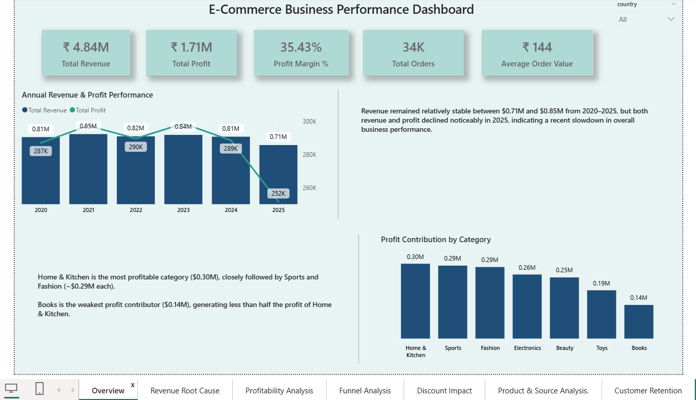
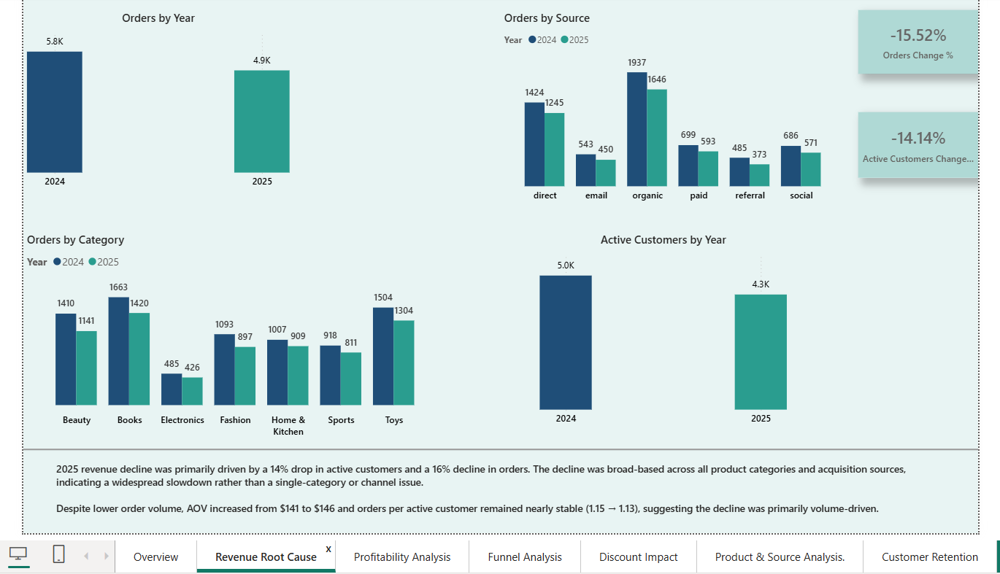
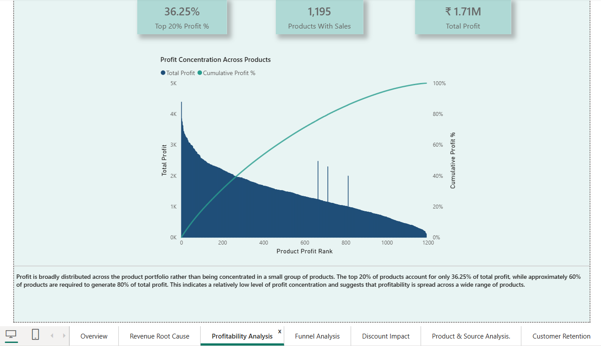
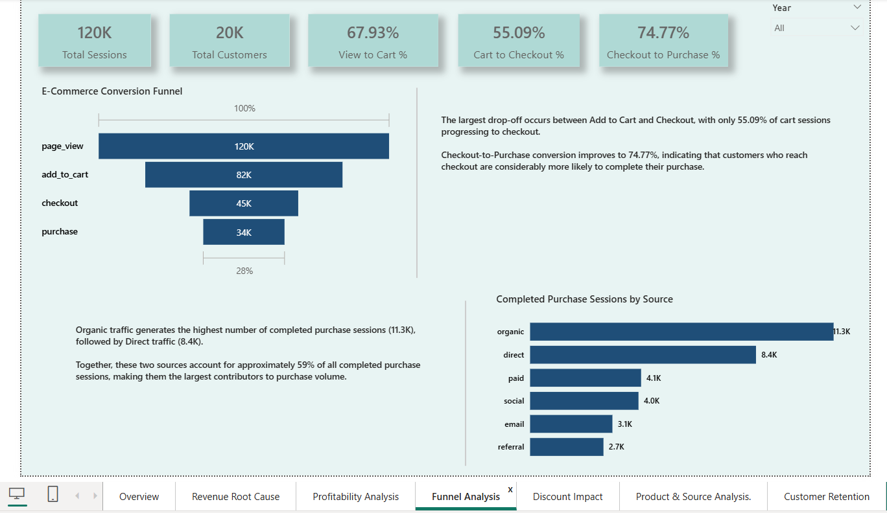
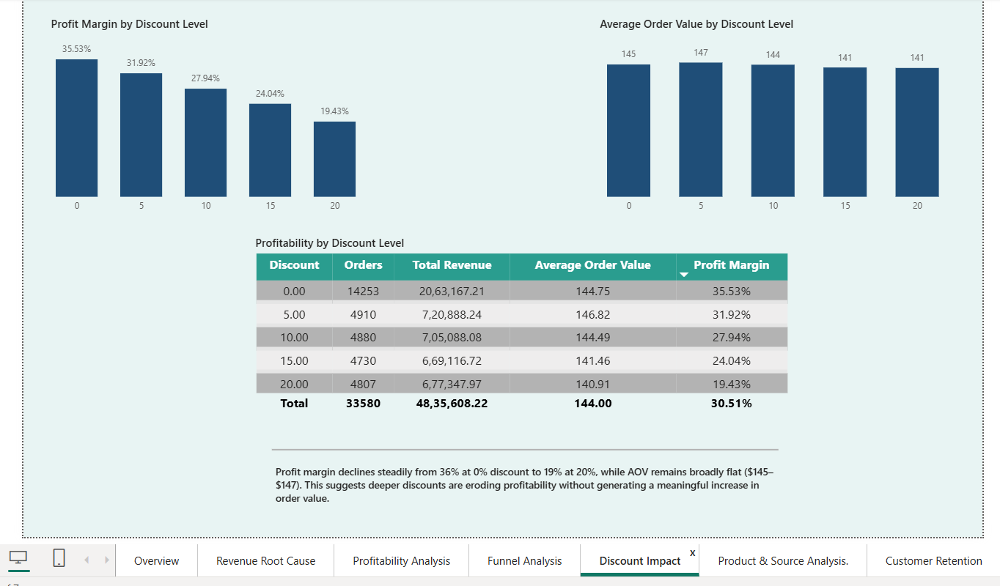
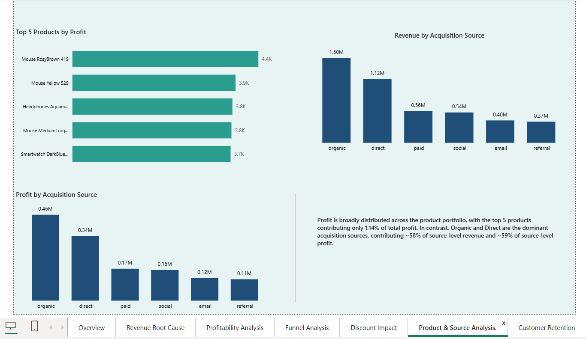
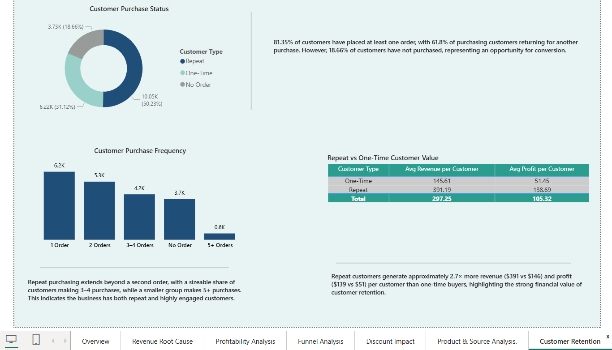

# Diagnostic E-Commerce Revenue & Customer Analysis

## Project Overview

An end-to-end e-commerce analytics project focused on diagnosing revenue decline and understanding the underlying drivers across customers, orders, products, acquisition sources, discounts, and retention.

The project combines Python-based data analysis with Power BI and DAX to transform transactional data into business-focused insights and recommendations.

## Business Problem

The business experienced a decline in revenue in 2025. The objective of this analysis was to determine:

- What caused the revenue decline?
- Was the decline driven by fewer customers, fewer orders, or lower spending?
- Which product categories contributed most to profitability?
- How effective are different discount levels?
- Which acquisition sources generate the most revenue and profit?
- Which products are the strongest profit contributors?
- Where do customers drop off in the purchase funnel?
- How well does the business retain and convert existing customers?

## Dataset

The dataset contains multiple e-commerce data sources covering:

- Customers
- Orders
- Order items
- Products
- Customer events
- Sessions
- Reviews

The dataset contains approximately:

- 20K customers
- 33K orders
- 59K order items
- 120K sessions
- 760K customer events
- 1K+ products
- 10K+ reviews

## Tools & Technologies

- Python
- Pandas
- NumPy
- Power BI
- DAX
- Power Query

## Analysis Performed

### 1. Revenue Root Cause Analysis

Analyzed revenue, orders, active customers, average order value, and orders per active customer to identify the primary drivers of the 2025 revenue decline.

### 2. Profitability Analysis

Evaluated profitability across product categories and identified the categories contributing the most and least profit.

### 3. Customer Funnel Analysis

Analyzed customer progression through:

**Page View → Add to Cart → Checkout → Purchase**

to identify major conversion drop-offs.

### 4. Discount Impact Analysis

Compared discount levels across orders, revenue, average order value, and profit margin to evaluate whether higher discounts generated sufficient customer value.

### 5. Product & Acquisition Source Analysis

Identified top products by profit and compared acquisition sources based on revenue and profit contribution.

### 6. Pareto Analysis

Analyzed the concentration of profit across products to determine how much of total profit was generated by the highest-performing products.

### 7. Customer Retention Analysis

Analyzed customer purchasing behavior and repeat-order patterns to understand retention and customer engagement.

## Key Findings

- 2025 revenue declined primarily due to a **14% decrease in active customers and a 16% decrease in orders**.
- The decline was broad-based across product categories and acquisition sources, indicating a widespread slowdown rather than a single-category or channel issue.
- AOV increased from approximately **$141 to $146**, while orders per active customer remained relatively stable, suggesting the revenue decline was primarily volume-driven.
- Profit margin declined from approximately **35.5% at 0% discount to 19.4% at 20% discount**, while AOV remained broadly flat.
- **Home & Kitchen** was the largest profit contributor at approximately **$0.30M**, followed closely by Sports and Fashion.
- **Organic** was the strongest acquisition source, generating approximately **$1.50M in revenue and $0.46M in profit**.
- The top 5 products generated approximately **$19.5K in profit**, representing a relatively small share of total profit, indicating that profitability was not heavily concentrated among a few products.

## Dashboard

### Overview

### Revenue Root Cause Analysis

### Profitability Analysis

### Funnel Analysis

### Discount Impact

### Product & Source Analysis

### Customer Retention

## Project Outcome

This project demonstrates an end-to-end analytical workflow:

**Data Preparation → Exploratory Analysis → Business Diagnosis → DAX Modeling → Power BI Dashboard → Business Insights**

The analysis focuses on moving beyond descriptive reporting to identify the underlying drivers of business performance and translate them into actionable insights.

## Business Recommendations

Based on the analysis:

- Focus on customer acquisition and reactivation to address the decline in active customers and order volume.
- Reassess high-discount campaigns, particularly 15–20% discounts, as they significantly reduce profit margins without materially increasing AOV.
- Prioritize high-performing acquisition channels such as Organic and Direct while evaluating the efficiency of lower-contributing sources.
- Monitor funnel drop-offs to identify opportunities to improve conversion from product engagement to purchase.
- Maintain focus on profitable product categories while monitoring lower-contributing categories for improvement opportunities.

## Skills Demonstrated

- Data Cleaning & Preparation
- Exploratory Data Analysis
- Business & Diagnostic Analysis
- Customer & Revenue Analytics
- Profitability Analysis
- Funnel Analysis
- Pareto Analysis
- Customer Retention Analysis
- DAX & Power BI
- Data Visualization
- Business Insight Generation
